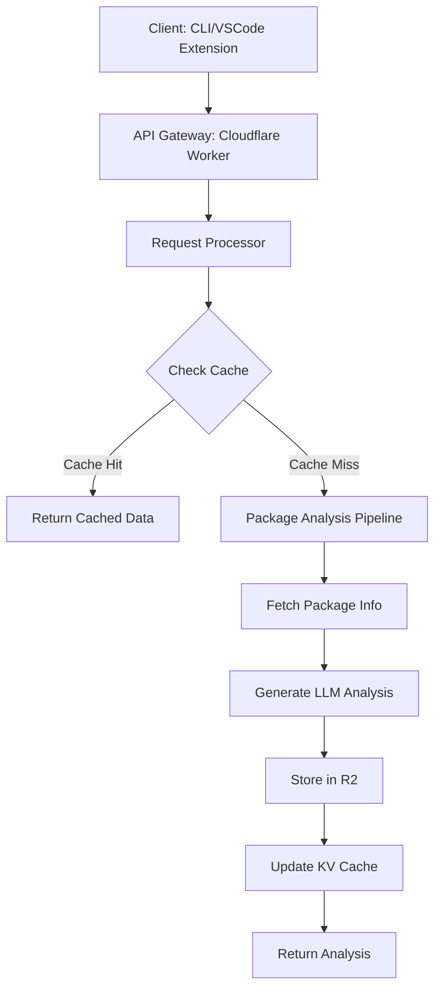

# PackageJSON Bot Architecture

## System Overview

PackageJSON Bot is a comprehensive dependency management system that automates package.json maintenance by leveraging AI and cloud infrastructure. The system is built on Cloudflare's serverless platform and uses Alchemy for AI-powered package analysis.

## High-Level Architecture



## Core Components

### 1. Client Layer

#### 1.1 CLI Tool

- Built with Node.js
- Scans project's package.json
- Communicates with backend API
- Manages local cache in `llm_modules`

#### 1.2 VSCode Extension

- Integrates with VSCode's UI
- Provides real-time package analysis
- Shows inline suggestions and updates

### 2. API Layer (Cloudflare Workers)

#### 2.1 API Gateway

- Handles authentication and rate limiting
- Routes requests to appropriate handlers
- Manages CORS and request validation

#### 2.2 Request Processor

- Validates incoming package requests
- Implements caching strategy
- Manages request/response flow

### 3. Data Layer

#### 3.1 Cloudflare R2 Storage

- Stores generated `package.llm.txt` files
- Organized by package name and version
- Serves as long-term storage

#### 3.2 Cloudflare KV Store

- Caches frequently accessed package data
- Implements TTL for cache invalidation
- Reduces redundant API calls

#### 3.3 Durable Objects

- Manages stateful operations
- Handles concurrent package analysis
- Implements distributed locking

### 4. AI Processing Layer (Alchemy)

#### 4.1 Package Analysis Service

- Fetches package data from npm registry
- Scans GitHub repositories and issues
- Analyzes documentation and changelogs

#### 4.2 LLM Integration

- Generates comprehensive package analysis
- Provides upgrade recommendations
- Identifies potential issues and conflicts

## Data Flow

1. **Client Request**
   - Client sends package details to API
   - Request includes package name and version
   - Authentication token is validated

2. **Cache Check**
   - System checks KV Store for cached analysis
   - If found and valid, returns cached data
   - If not found or expired, proceeds to analysis

3. **Package Analysis**
   - Fetches package metadata from npm registry
   - Retrieves repository information
   - Scans documentation and changelogs
   - Analyzes GitHub issues and PRs

4. **LLM Processing**
   - Sends collected data to Alchemy
   - Processes through LLM for analysis
   - Generates comprehensive package report

5. **Storage & Response**
   - Saves analysis to R2 storage
   - Updates KV Store cache
   - Returns analysis to client

## Alchemy Implementation

```typescript
// src/services/package-analysis.ts
import { Alchemy, Network } from 'alchemy-sdk';
import type { PackageAnalysis } from '../types';
import { getPackageMetadata } from './npm';
import { fetchGitHubData } from './github';
import { storeInR2 } from '../storage/r2';

const ALCHEMY_API_KEY = process.env.ALCHEMY_API_KEY;

if (!ALCHEMY_API_KEY) {
  throw new Error('ALCHEMY_API_KEY is not set in environment variables');
}

const alchemy = new Alchemy({
  apiKey: ALCHEMY_API_KEY,
  network: Network.ETH_MAINNET, // or your preferred network
});

export class PackageAnalysisService {
  private alchemy: Alchemy;
  
  constructor() {
    this.alchemy = alchemy;
  }

  async analyzePackage(pkg: string, version: string): Promise<PackageAnalysis> {
    // 1. Collect package data
    const [packageData, githubData] = await Promise.all([
      getPackageMetadata(pkg, version),
      fetchGitHubData(pkg, version)
    ]);
    
    // 2. Generate analysis prompt
    const prompt = this.generateAnalysisPrompt({
      ...packageData,
      ...githubData
    });
    
    // 3. Send to Alchemy
    const response = await this.alchemy.core.send({
      method: 'alchemy_generateText',
      params: [{
        prompt,
        max_tokens: 2000,
        temperature: 0.3,
      }]
    });
    
    // 4. Process and return analysis
    return this.processAnalysisResponse(response, pkg, version);
  }
  
  private generateAnalysisPrompt(data: any): string {
    return `Analyze the following npm package and provide a detailed report:
      
Package: ${data.name}@${data.version}
Description: ${data.description || 'No description'}
Repository: ${data.repository?.url || 'Not specified'}

Please provide:
1. Key features and functionality
2. Dependencies and their versions
3. Recent changes and breaking changes
4. Security considerations
5. Performance characteristics
6. Best practices for usage

Analysis:`;
  }
  
  private processAnalysisResponse(response: any, pkg: string, version: string): PackageAnalysis {
    // Implementation for processing Alchemy response
    return {
      package: `${pkg}@${version}`,
      analysis: response.result.text,
      timestamp: new Date().toISOString(),
      metadata: {
        model: response.model,
        tokens_used: response.usage.total_tokens,
      }
    };
  }
}
```

## Cloudflare Worker Implementation

```typescript
// src/worker.ts
import { handleRequest } from './handler';
import { handleCors } from './middleware/cors';
import { withErrorHandling } from './middleware/error';
import { withAuth } from './middleware/auth';

export interface Env {
  ALCHEMY_API_KEY: string;
  KV_CACHE: KVNamespace;
  R2_BUCKET: R2Bucket;
}

const handler: ExportedHandler<Env> = {
  async fetch(request: Request, env: Env, ctx: ExecutionContext): Promise<Response> {
    const url = new URL(request.url);
    
    // Handle CORS preflight
    if (request.method === 'OPTIONS') {
      return handleCors(request);
    }
    
    // Apply middlewares
    const authenticatedHandler = withAuth(withErrorHandling(handleRequest));
    
    // Route requests
    return authenticatedHandler(request, env, ctx);
  },
};

export default handler;
```

## Wrangler Configuration (wrangler.cjs)

```javascript
// wrangler.cjs
module.exports = {
  name: 'packagejson-bot',
  main: 'dist/worker.js',
  compatibility_date: '2023-05-30',
  
  // Environment variables
  vars: {
    ALCHEMY_API_KEY: '${ALCHEMY_API_KEY}',
    NODE_ENV: 'production',
  },
  
  // R2 Bucket configuration
  r2_buckets: [
    {
      binding: 'R2_BUCKET',
      bucket_name: 'package-llm-cache',
      preview_bucket_name: 'package-llm-cache-dev'
    }
  ],
  
  // KV Namespace configuration
  kv_namespaces: [
    {
      binding: 'KV_CACHE',
      id: '${KV_NAMESPACE_ID}',
      preview_id: '${KV_PREVIEW_NAMESPACE_ID}'
    }
  ],
  
  // Durable Objects
  durable_objects: {
    bindings: [
      {
        name: 'ANALYSIS_LOCK',
        class_name: 'AnalysisLock',
      }
    ]
  },
  
  // Scheduled tasks
  triggers: {
    crons: ['0 0 * * *']  // Daily cleanup job
  },
  
  // Build configuration
  build: {
    command: 'npm run build',
    cwd: '.',
    watch: './src/**/*.ts',
  },
  
  // Dev server configuration
  dev: {
    ip: 'localhost',
    port: 8787,
    local_protocol: 'http',
  },
  
  // Environment specific settings
  env: {
    development: {
      route: 'packagejson-bot-dev.your-username.workers.dev',
      vars: {
        NODE_ENV: 'development',
      },
    },
    production: {
      route: 'api.packagejsonbot.com/*',
      zone_id: '${CLOUDFLARE_ZONE_ID}',
      vars: {
        NODE_ENV: 'production',
      },
    },
  },
};
```

## Package.json Setup

```json
// package.json
{
  "name": "packagejson-bot",
  "version": "1.0.0",
  "private": true,
  "type": "module",
  "scripts": {
    "build": "tsc",
    "dev": "wrangler dev",
    "deploy": "wrangler deploy",
    "deploy:preview": "wrangler deploy --env development",
    "lint": "eslint . --ext .ts,.tsx",
    "typecheck": "tsc --noEmit"
  },
  "dependencies": {
    "@cloudflare/workers-types": "^4.20230518.0",
    "alchemy-sdk": "^3.0.0",
    "hono": "^3.0.0",
    "zod": "^3.21.0"
  },
  "devDependencies": {
    "@cloudflare/workers-types": "^4.20230518.0",
    "@types/node": "^20.0.0",
    "@typescript-eslint/eslint-plugin": "^8.38.0",
    "@typescript-eslint/parser": "^8.38.0",
    "eslint": "^9.31.0",
    "typescript": "^5.8.3",
    "vite": "^5.0.0",
    "wrangler": "^4.0.0"
  },
  "engines": {
    "node": ">=18.0.0"
  }
}
```

## Environment Variables

Create a `.dev.vars` file for local development:

```
# .dev.vars
ALCHEMY_API_KEY=your_alchemy_api_key_here
NODE_ENV=development
```

## TypeScript Configuration

```json
// tsconfig.json
{
  "compilerOptions": {
    "target": "ES2024",
    "module": "ESNext",
    "moduleResolution": "NodeNext",
    "esModuleInterop": true,
    "strict": true,
    "skipLibCheck": true,
    "forceConsistentCasingInFileNames": true,
    "outDir": "dist",
    "rootDir": "./src",
    "baseUrl": ".",
    "paths": {
      "@/*": ["src/*"]
    },
    "types": ["@cloudflare/workers-types"]
  },
  "include": ["src/**/*.ts"],
  "exclude": ["node_modules"]
}
```

## Getting Started

1. Install dependencies:

   ```bash
   npm install
   ```

2. Set up environment variables:

   ```bash
   cp .dev.vars.example .dev.vars
   # Edit .dev.vars with your actual API keys
   ```

3. Start development server:

   ```bash
   npm run dev
   ```

4. Deploy to Cloudflare Workers:

   ```bash
   # Login to Cloudflare
   npx wrangler login
   
   # Deploy to production
   npm run deploy
   
   # Deploy to preview environment
   npm run deploy:preview
   ```

5. Run tests:

   ```bash
   npm test
   ```

## Security Considerations

1. **Authentication**
   - API key authentication for all endpoints
   - Rate limiting per IP/API key
   - CORS policy enforcement

2. **Data Privacy**
   - No storage of package contents
   - Only public package metadata is processed
   - Regular data retention policies

3. **Error Handling**
   - Comprehensive error logging
   - Graceful degradation
   - Circuit breakers for external services

## Monitoring and Observability

1. **Logging**
   - Structured logging with request IDs
   - Error tracking and alerting
   - Performance metrics

2. **Metrics**
   - Request rates and latencies
   - Cache hit/miss ratios
   - Error rates by endpoint

3. **Alerting**
   - Error rate thresholds
   - Latency spikes
   - Service availability

## Future Enhancements

1. **Batch Processing**
   - Support for analyzing multiple packages in one request
   - Background processing for large projects

2. **Advanced Caching**
   - Edge caching with Cloudflare Cache
   - Stale-while-revalidate patterns

3. **Integration Ecosystem**
   - GitHub App for automated PRs
   - CI/CD pipeline integration
   - IDE plugins for other editors

## Conclusion

This architecture provides a scalable, serverless foundation for the PackageJSON Bot system. By leveraging Cloudflare's edge network and Alchemy's AI capabilities, we can deliver fast, intelligent package analysis to developers worldwide.
